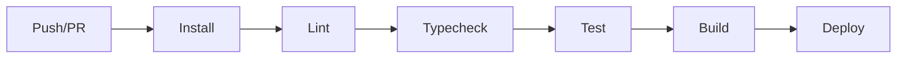

<div align="center">
  <a href="https://github.com/ifauzeee/Zee-Index">
    
  </a>

  <h1 align="center">⚡ Zee-Index</h1>

  <p align="center">
    <strong>Self-Hosted Google Drive CMS, Explorer & Streaming Platform</strong>
  </p>

  <p align="center">
    Transform your Google Drive into a professional portfolio website, media gallery, or file repository.<br>
    Features <strong>Shared Drive</strong> management, <strong>Instant Navigation</strong>, and <strong>High-Performance Streaming</strong>.
  </p>

  <div align="center">
    <a href="https://zee-index.vercel.app/">🔴 Live Demo</a>
    ·
    <a href="https://github.com/ifauzeee/Zee-Index/issues">🐛 Report Bug</a>
    ·
    <a href="https://github.com/ifauzeee/Zee-Index/pulls">✨ Request Feature</a>
  </div>

  <br />

  <div align="center">
    
    
    
    
    
    
  </div>
</div>

<br />

---

## 📚 Table of Contents

- [🌟 Key Features](#-key-features)
  - [Fast & Responsive](#-fast--responsive)
  - [Media Streaming](#-media-streaming)
  - [Security](#️-security)
  - [Multi-Drive Management](#️-multi-drive-management)
  - [Built-in Tools](#️-built-in-tools)
- [🛠️ Tech Stack](#️-tech-stack)
- [📂 Project Structure](#-project-structure)
- [🚀 Getting Started](#-getting-started)
  - [Prerequisites](#prerequisites)
  - [Installation Options](#installation-options)
    - [Local Development (Pro Mode)](#option-1-local-development-pro-mode)
    - [Docker Development](#option-2-docker-development)
    - [Full Docker Production](#option-3-full-docker-production)
- [⚙️ Environment Configuration](#️-environment-configuration)
  - [Required Variables](#required-variables)
  - [Optional Variables](#optional-variables)
  - [Complete .env Reference](#complete-env-reference)
- [📦 Deployment](#-deployment)
  - [Step 1: Google Cloud Setup](#step-1-google-cloud-setup)
  - [Step 2: Obtain Refresh Token](#step-2-obtain-refresh-token)
  - [Step 3: Deploy to Vercel](#step-3-deploy-to-vercel)
  - [Step 4: Deploy to Other Platforms](#step-4-deploy-to-other-platforms)
- [🐳 Docker Deployment](#-docker-deployment)
  - [Docker Compose (Recommended)](#docker-compose-recommended)
  - [Docker Build Arguments](#docker-build-arguments)
  - [Docker Health Checks](#docker-health-checks)
- [🔐 Authentication & Authorization](#-authentication--authorization)
- [📖 API Reference](#-api-reference)
- [🖱️ Keyboard Shortcuts](#️-keyboard-shortcuts)
- [🌍 Internationalization (i18n)](#-internationalization-i18n)
- [🧪 Testing](#-testing)
- [🔄 CI/CD Pipeline](#-cicd-pipeline)
- [📈 Monitoring & Logging](#-monitoring--logging)
- [⚠️ Troubleshooting](#️-troubleshooting)

- [🤝 Contributing](#-contributing)
- [📜 License](#-license)
- [🙏 Acknowledgments](#-acknowledgments)

---

## 🌟 Key Features

Zee-Index transforms your Google Drive into a powerful, self-hosted file system and media server.

### ⚡ Fast & Responsive

| Feature                     | Description                                                                                                  |
| --------------------------- | ------------------------------------------------------------------------------------------------------------ |
| **Virtualized Rendering**   | Built with `@tanstack/react-virtual` for smooth scrolling through folders with **10,000+ files** without lag |
| **Instant Visual Feedback** | Immediate click response with loading spinners on all interactive elements                                   |
| **Global Progress Bar**     | Visual top-loading bar for premium app-like navigation experience                                            |
| **Smart Prefetching**       | Intelligently preloads folder contents on hover for instant navigation                                       |
| **Turbopack Bundler**       | Uses Next.js 16's Turbopack for blazing-fast development builds                                              |
| **Redis Caching**           | Multi-layer caching with Redis/Vercel KV for optimized API responses                                         |

### 🎬 Media Streaming

| Feature                     | Description                                                                                |
| --------------------------- | ------------------------------------------------------------------------------------------ |
| **Direct Stream**           | Optimized headers (`Cache-Control: no-transform`) ensure video streams without re-encoding |
| **Universal Audio Dock**    | Persistent audio player that continues playing while navigating                            |
| **Adaptive Video Player**   | Integrated with VidStack for professional video playback experience                        |
| **Auto-Subtitle Detection** | Automatic detection of `.srt` and `.vtt` subtitle files                                    |
| **Modern Gallery**          | High-performance lightboxes for images using `yet-another-react-lightbox`                  |
| **PDF Viewer**              | Built-in PDF viewer with `react-pdf` integration                                           |
| **Archive Preview**         | Preview contents of ZIP archives without downloading                                       |

### 🛡️ Security

| Feature                         | Description                                                     |
| ------------------------------- | --------------------------------------------------------------- |
| **Recursive Folder Protection** | Parent folder locks automatically protect all nested content    |
| **Two-Factor Authentication**   | Optional 2FA with TOTP using `otplib`                           |
| **Role-Based Access Control**   | Configurable Guest, User, and Admin roles                       |
| **Rate Limiting**               | Built-in API protection with configurable rate limits           |
| **Share Link Protection**       | JWT-signed share links with optional authentication requirement |
| **Security Headers**            | Comprehensive security headers (X-Frame-Options, CSP, etc.)     |

### 🗂️ Multi-Drive Management

| Feature                      | Description                                              |
| ---------------------------- | -------------------------------------------------------- |
| **Unified Sidebar**          | Consolidate multiple Personal, Shared, and Team Drives   |
| **Folder Aliases**           | Rename folders in UI without changing Google Drive names |
| **Private Folders**          | Configure specific folders to be hidden from non-admins  |
| **Manual Drive Addition**    | Add additional drives via configuration                  |
| **Favorites & Pinned Items** | Quick access to frequently used files and folders        |

### 🛠️ Built-in Tools

| Feature                | Description                                                |
| ---------------------- | ---------------------------------------------------------- |
| **Code Editor**        | Syntax highlighting for 20+ programming languages          |
| **Data Usage Monitor** | Real-time storage usage calculation with progress tracking |
| **File Request**       | Create secure public upload links                          |
| **Bulk Download**      | Download multiple files as ZIP archive                     |
| **Trash Management**   | View and restore deleted files                             |
| **Search**             | Full-text search across all accessible files               |
| **Tags**               | Organize files with custom tags                            |

---

## 🛠️ Tech Stack

### Core Framework

| Technology                                    | Version | Purpose                         |
| --------------------------------------------- | ------- | ------------------------------- |
| [Next.js](https://nextjs.org/)                | 16.1.x  | React framework with App Router |
| [React](https://react.dev/)                   | 19.x    | UI library                      |
| [TypeScript](https://www.typescriptlang.org/) | 5.x     | Type safety                     |

### Styling & UI

| Technology                                      | Purpose               |
| ----------------------------------------------- | --------------------- |
| [Tailwind CSS](https://tailwindcss.com/)        | Utility-first CSS     |
| [Framer Motion](https://www.framer.com/motion/) | Animations            |
| [Radix UI](https://www.radix-ui.com/)           | Accessible components |
| [Lucide React](https://lucide.dev/)             | Icons                 |

### State Management

| Technology                                   | Purpose                |
| -------------------------------------------- | ---------------------- |
| [Zustand](https://zustand-demo.pmnd.rs/)     | Global state           |
| [TanStack Query](https://tanstack.com/query) | Server state & caching |
| [SWR](https://swr.vercel.app/)               | Data fetching          |

### Backend Services

| Technology                                                 | Purpose        |
| ---------------------------------------------------------- | -------------- |
| [NextAuth.js](https://next-auth.js.org/)                   | Authentication |
| [Vercel KV / Redis](https://vercel.com/storage/kv)         | Caching layer  |
| [Google Drive API v3](https://developers.google.com/drive) | File storage   |

### Development Tools

| Technology                                 | Purpose         |
| ------------------------------------------ | --------------- |
| [Vitest](https://vitest.dev/)              | Unit testing    |
| [Playwright](https://playwright.dev/)      | E2E testing     |
| [ESLint](https://eslint.org/)              | Linting         |
| [Prettier](https://prettier.io/)           | Code formatting |
| [Husky](https://typicode.github.io/husky/) | Git hooks       |

---

## 📂 Project Structure

```
zee-index/
├── 📁 app/                      # Next.js App Router
│   ├── 📁 [locale]/             # Internationalized routes
│   │   ├── 📁 (main)/           # Main layout group
│   │   ├── 📁 admin/            # Admin dashboard pages
│   │   ├── 📁 folder/           # Folder view pages
│   │   ├── 📁 share/            # Share link pages
│   │   └── 📁 ...               # Other pages
│   ├── 📁 api/                  # API Routes
│   │   ├── 📁 admin/            # Admin-only APIs
│   │   ├── 📁 auth/             # NextAuth handlers
│   │   ├── 📁 files/            # File operations
│   │   ├── 📁 share/            # Share link APIs
│   │   ├── 📁 cron/             # Scheduled tasks
│   │   └── 📁 ...               # Other API routes
│   ├── 📄 providers.tsx         # Global providers
│   ├── 📄 global-error.tsx      # Error boundary
│   └── 📄 manifest.ts           # PWA manifest
│
├── 📁 components/               # React Components
│   ├── 📁 admin/                # Admin dashboard components
│   ├── 📁 charts/               # Data visualization
│   ├── 📁 common/               # Shared components
│   ├── 📁 features/             # Feature-specific components
│   ├── 📁 file-browser/         # File listing & navigation
│   ├── 📁 file-details/         # File preview & info
│   ├── 📁 layout/               # Layout components
│   ├── 📁 modals/               # Modal dialogs
│   ├── 📁 providers/            # Context providers
│   └── 📁 ui/                   # Base UI components
│
├── 📁 lib/                      # Utility Functions
│   ├── 📁 drive/                # Google Drive API helpers
│   ├── 📄 auth.ts               # Auth utilities
│   ├── 📄 authOptions.ts        # NextAuth configuration
│   ├── 📄 kv.ts                 # Redis/KV client
│   ├── 📄 store.ts              # Zustand stores
│   ├── 📄 ratelimit.ts          # Rate limiting utilities
│   ├── 📄 env.ts                # Environment validation
│   └── 📄 utils.ts              # General utilities
│
├── 📁 hooks/                    # Custom React Hooks
├── 📁 types/                    # TypeScript Definitions
├── 📁 messages/                 # i18n Translation Files
│   ├── 📄 en.json               # English
│   └── 📄 id.json               # Indonesian
│
├── 📁 __tests__/                # Unit Tests
├── 📁 e2e/                      # End-to-End Tests
├── 📁 public/                   # Static Assets
├── 📁 .github/                  # GitHub Configuration
│   └── 📁 workflows/            # CI/CD Pipelines
│
├── 📄 .env.example              # Environment Template
├── 📄 docker-compose.yml        # Production Docker
├── 📄 docker-compose.redis.yml  # Dev Redis Container
├── 📄 Dockerfile                # Multi-stage Build
├── 📄 middleware.ts             # Next.js Middleware
├── 📄 next.config.mjs           # Next.js Configuration
├── 📄 tailwind.config.ts        # Tailwind Configuration
├── 📄 vercel.json               # Vercel Configuration
└── 📄 package.json              # Dependencies
```

---

## 🚀 Getting Started

### Prerequisites

Before you begin, ensure you have the following installed:

| Requirement        | Version        | Download                                                      |
| ------------------ | -------------- | ------------------------------------------------------------- |
| **Node.js**        | 20.x or higher | [nodejs.org](https://nodejs.org/)                             |
| **pnpm**           | 9.x or higher  | [pnpm.io](https://pnpm.io/)                                   |
| **Docker Desktop** | Latest         | [docker.com](https://www.docker.com/products/docker-desktop/) |
| **Git**            | Latest         | [git-scm.com](https://git-scm.com/)                           |

You'll also need:

- A **Google Cloud Project** with Drive API enabled
- **OAuth 2.0 Credentials** (Client ID & Secret)
- A **Google Drive folder** to use as root

### Installation Options

Choose the installation method that best fits your needs:

---

#### Option 1: Local Development (Pro Mode)

This mode runs Redis in a lightweight Docker container for persistent caching while using `pnpm dev` for hot module replacement.

```bash
# 1. Clone the repository
git clone https://github.com/ifauzeee/Zee-Index.git
cd Zee-Index

# 2. Install dependencies
pnpm install

# 3. Configure environment
cp .env.example .env
# Edit .env with your credentials (see Configuration section)

# 4. Start Redis container
pnpm redis:up

# 5. Start development server (in a new terminal)
pnpm dev

# 6. Open http://localhost:3000 in your browser
```

**Additional Commands:**

```bash
# Stop Redis when done
pnpm redis:down

# Run without Turbopack (if issues arise)
pnpm dev:webpack

# Type checking
pnpm typecheck

# Linting
pnpm lint

# Run all checks
pnpm check:all
```

---

#### Option 2: Docker Development

Build and run the entire application in Docker for a production-like environment.

```bash
# 1. Clone and configure
git clone https://github.com/ifauzeee/Zee-Index.git
cd Zee-Index
cp .env.example .env
# Edit .env with your credentials

# 2. Build and start
docker compose up --build

# 3. Access at http://localhost:3000
```

---

#### Option 3: Full Docker Production

Deploy with optimized production settings.

```bash
# Build optimized production image
docker compose build

# Run in detached mode
docker compose up -d

# View logs
docker compose logs -f zee-index

# Stop the container
docker compose down
```

---

## ⚙️ Environment Configuration

### Required Variables

These variables **must** be set for the application to function:

| Variable                     | Description                                      | Example                                             |
| ---------------------------- | ------------------------------------------------ | --------------------------------------------------- |
| `NEXTAUTH_URL`               | Your application URL                             | `http://localhost:3000` or `https://yourdomain.com` |
| `NEXTAUTH_SECRET`            | Random encryption key (min 32 chars)             | Generate with `openssl rand -base64 32`             |
| `GOOGLE_CLIENT_ID`           | OAuth Client ID from Google Cloud                | `xxx.apps.googleusercontent.com`                    |
| `GOOGLE_CLIENT_SECRET`       | OAuth Client Secret                              | `GOCSPX-xxx`                                        |
| `GOOGLE_REFRESH_TOKEN`       | OAuth Refresh Token                              | Obtained via `/setup` flow                          |
| `NEXT_PUBLIC_ROOT_FOLDER_ID` | Google Drive folder ID to use as root            | `1abc...xyz`                                        |
| `ADMIN_EMAILS`               | Comma-separated admin emails                     | `admin@example.com,owner@example.com`               |
| `ADMIN_PASSWORD`             | Password for admin fallback login                | Strong password                                     |
| `SHARE_SECRET_KEY`           | Random key for signing share URLs (min 32 chars) | Generate with `openssl rand -base64 32`             |

### Optional Variables

| Variable                       | Description                         | Default                     |
| ------------------------------ | ----------------------------------- | --------------------------- |
| `KV_REST_API_URL`              | Redis/Vercel KV URL                 | In-memory cache if not set  |
| `KV_REST_API_TOKEN`            | Redis/Vercel KV Token               | Required if using Vercel KV |
| `REDIS_URL`                    | Alternative Redis connection string | `redis://localhost:6379`    |
| `STORAGE_PROVIDER`             | Storage backend                     | `google-drive`              |
| `NEXT_PUBLIC_ROOT_FOLDER_NAME` | Display name for root folder        | `Home`                      |
| `NEXT_PUBLIC_MANUAL_DRIVES`    | JSON array of additional drives     | `[]`                        |
| `PRIVATE_FOLDER_IDS`           | JSON array of private folder IDs    | `[]`                        |
| `STORAGE_LIMIT_GB`             | Storage warning limit in GB         | `15`                        |
| `STORAGE_WARNING_THRESHOLD`    | Warning threshold (0-1)             | `0.90`                      |
| `NEXT_PUBLIC_SENTRY_DSN`       | Sentry error tracking DSN           | Empty                       |
| `CRON_SECRET`                  | Secret for cron job authentication  | Random string               |
| `SKIP_ENV_VALIDATION`          | Skip env validation during build    | `false`                     |

### Email Configuration (Optional)

| Variable     | Description                   | Default                            |
| ------------ | ----------------------------- | ---------------------------------- |
| `SMTP_HOST`  | SMTP server hostname          | `smtp.gmail.com`                   |
| `SMTP_PORT`  | SMTP server port              | `465`                              |
| `SMTP_USER`  | SMTP username/email           | -                                  |
| `SMTP_PASS`  | SMTP password or app password | -                                  |
| `EMAIL_FROM` | Sender email address          | `Zee Index <no-reply@example.com>` |

### Complete .env Reference

```bash
# ==============================================================================
# ZEE-INDEX CONFIGURATION
# ==============================================================================

# ------------------------------------------------------------------------------
# 1. CORE APPLICATION SETTINGS
# ------------------------------------------------------------------------------
NEXTAUTH_URL="http://localhost:3000"
NEXTAUTH_SECRET="your-super-secret-key-minimum-32-characters-long"
SHARE_SECRET_KEY="another-secret-key-minimum-32-characters-long"

ADMIN_EMAILS="admin@example.com"
ADMIN_PASSWORD="your-secure-admin-password"

# ------------------------------------------------------------------------------
# 2. STORAGE CONFIGURATION
# ------------------------------------------------------------------------------
STORAGE_PROVIDER="google-drive"

NEXT_PUBLIC_ROOT_FOLDER_ID="your-google-drive-folder-id"
NEXT_PUBLIC_ROOT_FOLDER_NAME="Home"

# Optional: Add multiple drives (JSON array)
# NEXT_PUBLIC_MANUAL_DRIVES='[{"id":"drive_id","name":"Drive Name"}]'

# Optional: Private folder IDs (JSON array)
# PRIVATE_FOLDER_IDS='["folder_id_1","folder_id_2"]'

# ------------------------------------------------------------------------------
# 3. GOOGLE DRIVE PROVIDER
# ------------------------------------------------------------------------------
GOOGLE_CLIENT_ID="your-client-id.apps.googleusercontent.com"
GOOGLE_CLIENT_SECRET="your-client-secret"
GOOGLE_REFRESH_TOKEN="your-refresh-token"

# ------------------------------------------------------------------------------
# 4. REDIS/CACHE CONFIGURATION
# ------------------------------------------------------------------------------
# For Local Docker Redis:
# KV_REST_API_URL="redis://localhost:6379"
# KV_REST_API_TOKEN=""

# For Vercel KV:
# KV_REST_API_URL="https://your-instance.kv.vercel-storage.com"
# KV_REST_API_TOKEN="your-vercel-kv-token"

# ------------------------------------------------------------------------------
# 5. LIMITS & MONITORING
# ------------------------------------------------------------------------------
STORAGE_LIMIT_GB=15
STORAGE_WARNING_THRESHOLD=0.90

NEXT_PUBLIC_SENTRY_DSN=""

# ------------------------------------------------------------------------------
# 6. EMAIL CONFIGURATION (Optional)
# ------------------------------------------------------------------------------
# SMTP_HOST="smtp.gmail.com"
# SMTP_PORT="465"
# SMTP_USER="your-email@gmail.com"
# SMTP_PASS="your-app-password"
# EMAIL_FROM="Zee Index <no-reply@example.com>"

# ------------------------------------------------------------------------------
# 7. CRON & WEBHOOKS
# ------------------------------------------------------------------------------
CRON_SECRET="random-string-for-cron-protection"
# WEBHOOK_URL=""

# ------------------------------------------------------------------------------
# 8. BUILD SETTINGS
# ------------------------------------------------------------------------------
SKIP_ENV_VALIDATION=false
```

---

## 📦 Deployment

### Step 1: Google Cloud Setup

1. **Create a Google Cloud Project**
   - Go to [Google Cloud Console](https://console.cloud.google.com/)
   - Create a new project or select an existing one

2. **Enable Google Drive API**
   - Navigate to **APIs & Services** → **Library**
   - Search for "Google Drive API"
   - Click **Enable**

3. **Create OAuth 2.0 Credentials**
   - Go to **APIs & Services** → **Credentials**
   - Click **Create Credentials** → **OAuth client ID**
   - Select **Web application**
   - Add **Authorized redirect URIs**:
     - For development: `http://localhost:3000/setup`
     - For production: `https://yourdomain.com/setup`
   - Save your **Client ID** and **Client Secret**

4. **Configure OAuth Consent Screen**
   - Go to **APIs & Services** → **OAuth consent screen**
   - Fill in required fields (App name, support email, etc.)
   - Add scopes:
     - `https://www.googleapis.com/auth/drive`
     - `https://www.googleapis.com/auth/drive.file`
     - `https://www.googleapis.com/auth/userinfo.email`
     - `https://www.googleapis.com/auth/userinfo.profile`

### Step 2: Obtain Refresh Token

1. **Start the application** with your Google credentials in `.env`:

   ```bash
   GOOGLE_CLIENT_ID="your-client-id"
   GOOGLE_CLIENT_SECRET="your-client-secret"
   GOOGLE_REFRESH_TOKEN=""  # Leave empty initially
   ```

2. **Navigate to `/setup`** in your browser

3. **Complete the OAuth flow** by signing in with your Google account

4. **Copy the Refresh Token** displayed and add it to your `.env`:

   ```bash
   GOOGLE_REFRESH_TOKEN="your-newly-obtained-refresh-token"
   ```

5. **Restart the application** to apply changes

### Step 3: Deploy to Vercel

[](https://vercel.com/new/clone?repository-url=https%3A%2F%2Fgithub.com%2Fifauzeee%2FZee-Index)

**Manual Deployment:**

1. **Install Vercel CLI**

   ```bash
   npm i -g vercel
   ```

2. **Deploy**

   ```bash
   vercel
   ```

3. **Add Environment Variables**
   - Go to your project's Vercel dashboard
   - Navigate to **Settings** → **Environment Variables**
   - Add all required variables

4. **Set Up Vercel KV**
   - Go to **Storage** → **Create Database** → **KV**
   - Follow the setup wizard
   - Environment variables will be automatically added

5. **Configure Cron Jobs** (Optional)

   The `vercel.json` includes pre-configured cron jobs:

   ```json
   {
     "crons": [
       {
         "path": "/api/cron/storage-check",
         "schedule": "0 5 * * *"
       },
       {
         "path": "/api/cron/weekly-report",
         "schedule": "0 6 * * 0"
       }
     ]
   }
   ```

### Step 4: Deploy to Other Platforms

#### Railway

1. Create a new project on [Railway](https://railway.app/)
2. Connect your GitHub repository
3. Add environment variables
4. Deploy

#### Render

1. Create a new Web Service on [Render](https://render.com/)
2. Connect your repository
3. Set build command: `pnpm install && pnpm build`
4. Set start command: `pnpm start`
5. Add environment variables

#### DigitalOcean App Platform

1. Create a new App on [DigitalOcean](https://www.digitalocean.com/products/app-platform)
2. Connect your repository
3. Configure as Node.js app
4. Add environment variables
5. Deploy

---

## 🐳 Docker Deployment

### Docker Compose (Recommended)

The project includes an optimized multi-stage Dockerfile with the following features:

- **Alpine-based images** for minimal size (~150MB)
- **pnpm for efficient caching**
- **Non-root user** for security
- **Health checks** for reliability
- **dumb-init** for proper signal handling

**Production Deployment:**

```bash
# Build and run
docker compose up --build -d

# View logs
docker compose logs -f

# Stop
docker compose down
```

**Docker Compose Configuration:**

```yaml
services:
  zee-index:
    container_name: zee-index
    build:
      context: .
      dockerfile: Dockerfile
      args:
        NEXT_PUBLIC_ROOT_FOLDER_ID: ${NEXT_PUBLIC_ROOT_FOLDER_ID}
        NEXT_PUBLIC_ROOT_FOLDER_NAME: ${NEXT_PUBLIC_ROOT_FOLDER_NAME}
        BUILDKIT_INLINE_CACHE: 1
    restart: always
    ports:
      - "3000:3000"
    env_file:
      - .env
    healthcheck:
      test: ["CMD", "curl", "-f", "http://localhost:3000/api/health"]
      interval: 30s
      timeout: 10s
      retries: 3
      start_period: 40s
```

### Docker Build Arguments

The Dockerfile accepts these build arguments for environment variables needed at build time:

| Argument                       | Description                        |
| ------------------------------ | ---------------------------------- |
| `NEXT_PUBLIC_ROOT_FOLDER_ID`   | Root folder ID (required at build) |
| `NEXT_PUBLIC_ROOT_FOLDER_NAME` | Root folder display name           |
| `NEXT_PUBLIC_SENTRY_DSN`       | Sentry DSN for error tracking      |

### Docker Health Checks

The container includes health checks that monitor the `/api/health` endpoint:

```dockerfile
HEALTHCHECK --interval=30s --timeout=10s --start-period=40s --retries=3 \
    CMD curl -f http://localhost:3000/api/health || exit 1
```

### Automatic HTTPS with DuckDNS & Caddy

The attached `docker-compose.yml` includes built-in support for **DuckDNS** (Dynamic DNS) and **Caddy** (Reverse Proxy & Auto SSL).

1. **Obtain DuckDNS Token**
   - Go to [DuckDNS](https://www.duckdns.org/)
   - Create a domain (e.g., `my-drive.duckdns.org`)
   - Copy your **Token**

2. **Configure Environment**
   - Add these lines to your `.env` file:
     ```bash
     DUCKDNS_DOMAIN="my-drive"
     DUCKDNS_TOKEN="your-duckdns-token"
     ```
   - Change `NEXTAUTH_URL` in `.env` to your new HTTPS URL:
     ```bash
     NEXTAUTH_URL="https://my-drive.duckdns.org"
     ```

3. **Deploy**
   - Caddy will automatically provision an SSL certificate from Let's Encrypt.
   - DuckDNS container will keep your home IP address updated.

---

## 🔐 Authentication & Authorization

Zee-Index supports multiple authentication methods:

### Authentication Methods

| Method             | Description                 | Configuration               |
| ------------------ | --------------------------- | --------------------------- |
| **Google OAuth**   | Sign in with Google account | Configure OAuth credentials |
| **Admin Password** | Fallback admin login        | Set `ADMIN_PASSWORD`        |
| **Guest Access**   | Limited read-only access    | Enabled by default          |
| **2FA (TOTP)**     | Optional two-factor auth    | Admin configuration         |

### Role Hierarchy

| Role      | Permissions                                              |
| --------- | -------------------------------------------------------- |
| **ADMIN** | Full access to all features, settings, and configuration |
| **USER**  | Standard access to files in permitted folders            |
| **GUEST** | Read-only access to public folders                       |

### Protected Routes

| Route       | Required Role | Description                            |
| ----------- | ------------- | -------------------------------------- |
| `/admin/*`  | ADMIN         | Admin dashboard and settings           |
| `/folder/*` | USER+         | File browsing                          |
| `/share/*`  | PUBLIC        | Shared links (with token)              |
| `/setup`    | PUBLIC        | Initial setup (only when unconfigured) |

---

## 📖 API Reference

### Public APIs (No Authentication Required)

| Method | Endpoint             | Description                    |
| ------ | -------------------- | ------------------------------ |
| `GET`  | `/api/health`        | Health check endpoint          |
| `GET`  | `/api/config/public` | Public configuration           |
| `GET`  | `/api/files`         | List files with optional token |
| `GET`  | `/api/download/[id]` | Download file (with token)     |

### Authenticated APIs

| Method | Endpoint                | Description         |
| ------ | ----------------------- | ------------------- |
| `GET`  | `/api/folder/[id]`      | Get folder contents |
| `GET`  | `/api/filedetails/[id]` | Get file details    |
| `GET`  | `/api/search`           | Search files        |
| `GET`  | `/api/datausage`        | Get storage usage   |
| `POST` | `/api/favorites`        | Manage favorites    |
| `POST` | `/api/share/create`     | Create share link   |

### Admin APIs

| Method   | Endpoint                | Description          |
| -------- | ----------------------- | -------------------- |
| `GET`    | `/api/admin/stats`      | Dashboard statistics |
| `GET`    | `/api/admin/activity`   | Activity logs        |
| `POST`   | `/api/admin/config`     | Update configuration |
| `POST`   | `/api/admin/2fa/setup`  | Configure 2FA        |
| `DELETE` | `/api/admin/clearcache` | Clear cache          |

### Cron Job APIs

| Method | Endpoint                  | Description            | Schedule        |
| ------ | ------------------------- | ---------------------- | --------------- |
| `GET`  | `/api/cron/storage-check` | Check storage usage    | Daily at 5 AM   |
| `GET`  | `/api/cron/weekly-report` | Generate weekly report | Sundays at 6 AM |

---

## 🖱️ Keyboard Shortcuts

| Key            | Function                      |
| -------------- | ----------------------------- |
| `Cmd/Ctrl + K` | Open Command Palette          |
| `/`            | Focus Search                  |
| `Space`        | Quick Preview                 |
| `Delete`       | Delete Selected File          |
| `Ctrl + A`     | Select All Files              |
| `F2`           | Rename Selected File          |
| `Escape`       | Close Modal / Clear Selection |
| `Enter`        | Open Selected Item            |
| `G then H`     | Go to Home                    |

---

## 🌍 Internationalization (i18n)

Zee-Index supports multiple languages using `next-intl`:

### Supported Languages

| Language   | Code | File               |
| ---------- | ---- | ------------------ |
| English    | `en` | `messages/en.json` |
| Indonesian | `id` | `messages/id.json` |

### Adding a New Language

1. Create a new JSON file in `messages/`:

   ```bash
   cp messages/en.json messages/fr.json
   ```

2. Translate all strings in the new file

3. Add the locale to `middleware.ts`:

   ```typescript
   const intlMiddleware = createMiddleware({
     locales: ["en", "id", "fr"],
     defaultLocale: "en",
     localePrefix: "always",
   });
   ```

4. Update `i18n.ts` if needed

---

## 🧪 Testing

### Unit Tests (Vitest)

```bash
# Run tests
pnpm test

# Run in watch mode
pnpm test -- --watch

# Generate coverage report
pnpm test -- --coverage
```

### End-to-End Tests (Playwright)

```bash
# Install browsers (first time)
npx playwright install

# Run E2E tests
pnpm test:e2e

# Run with UI
npx playwright test --ui

# Generate HTML report
npx playwright show-report
```

### Test Structure

```
__tests__/           # Unit tests
  ├── components/    # Component tests
  ├── lib/           # Utility tests
  └── api/           # API route tests

e2e/                 # End-to-end tests
  └── *.spec.ts      # Playwright specs
```

---

## 🔄 CI/CD Pipeline

### GitHub Actions Workflows

| Workflow             | Trigger         | Description                  |
| -------------------- | --------------- | ---------------------------- |
| `ci.yml`             | Push/PR to main | Lint, typecheck, test, build |
| `test.yml`           | Push/PR         | Run unit tests               |
| `playwright.yml`     | Push/PR         | Run E2E tests                |
| `docker-publish.yml` | Release         | Build and push Docker image  |

### CI Pipeline Steps



### Required Secrets

| Secret            | Description             |
| ----------------- | ----------------------- |
| `DOCKER_USERNAME` | Docker Hub username     |
| `DOCKER_PASSWORD` | Docker Hub password     |
| `VERCEL_TOKEN`    | Vercel deployment token |

---

## 📈 Monitoring & Logging

### Built-in Logging

- Request logging with path and duration
- Error logging with stack traces
- Activity logging for admin actions

### Sentry Integration (Optional)

1. Add your Sentry DSN:

   ```bash
   NEXT_PUBLIC_SENTRY_DSN="https://xxxxx@sentry.io/xxxxx"
   ```

2. Errors will be automatically reported to Sentry

### Health Endpoint

```bash
curl http://localhost:3000/api/health
```

Response:

```json
{
  "status": "healthy",
  "timestamp": "2025-01-01T00:00:00Z"
}
```

---

## ⚠️ Troubleshooting

### Common Issues

<details>
<summary><strong>Login Failed</strong></summary>

**Symptoms:** Unable to login, credentials rejected

**Solutions:**

1. Check `ADMIN_EMAILS` in `.env` matches your email exactly
2. Ensure `ADMIN_PASSWORD` is set correctly (no quotes around value)
3. Clear browser cookies and try again
4. Check server logs for specific error messages
</details>

<details>
<summary><strong>Redis Connection Error</strong></summary>

**Symptoms:** Cache errors, slow performance

**Solutions:**

1. For local development, ensure Redis container is running:
   ```bash
   pnpm redis:up
   docker ps  # Verify container is running
   ```
2. Check `KV_REST_API_URL` matches your Redis setup:
   - Local Docker: `redis://localhost:6379`
   - Vercel KV: Use provided URL
3. If using Vercel KV, ensure token is correct
</details>

<details>
<summary><strong>Google Drive API Errors</strong></summary>

**Symptoms:** Files not loading, 401/403 errors

**Solutions:**

1. Verify `GOOGLE_REFRESH_TOKEN` is valid
2. Re-run the `/setup` flow to get a new token
3. Check API quotas in Google Cloud Console
4. Ensure the service account has access to the folders
</details>

<details>
<summary><strong>Build Failures</strong></summary>

**Symptoms:** Build fails with environment variable errors

**Solutions:**

1. Check all required env variables are set
2. For CI/CD, add mock values for build:
   ```bash
   SKIP_ENV_VALIDATION=true pnpm build
   ```
3. Verify `next.config.mjs` has no syntax errors
</details>

<details>
<summary><strong>Docker Build Issues</strong></summary>

**Symptoms:** Docker build fails or container crashes

**Solutions:**

1. Ensure Docker BuildKit is enabled:
   ```bash
   export DOCKER_BUILDKIT=1
   ```
2. Check memory allocation for Docker
3. Verify `.dockerignore` excludes `node_modules`
4. Try building without cache:
   ```bash
   docker compose build --no-cache
   ```
   </details>

<details>
<summary><strong>Performance Issues</strong></summary>

**Symptoms:** Slow page loads, timeouts

**Solutions:**

1. Enable Redis caching (don't rely on in-memory cache)
2. Check Google Drive API quotas
3. Reduce folder sizes (virtualization helps but has limits)
4. Enable PWA caching
</details>

---

## 🤝 Contributing

We welcome contributions from the community! Please read our [Contributing Guide](CONTRIBUTING.md) before submitting a Pull Request.

### Quick Start for Contributors

```bash
# 1. Fork the repository

# 2. Clone your fork
git clone https://github.com/YOUR_USERNAME/Zee-Index.git

# 3. Create a feature branch
git checkout -b feature/amazing-feature

# 4. Make your changes
pnpm install
pnpm dev

# 5. Run all checks
pnpm check:all

# 6. Commit your changes
git commit -m "feat: add amazing feature"

# 7. Push and create a Pull Request
git push origin feature/amazing-feature
```

### Commit Convention

We follow [Conventional Commits](https://www.conventionalcommits.org/):

| Type       | Description                   |
| ---------- | ----------------------------- |
| `feat`     | New feature                   |
| `fix`      | Bug fix                       |
| `docs`     | Documentation only            |
| `style`    | Code style (formatting, etc.) |
| `refactor` | Code refactoring              |
| `test`     | Adding tests                  |
| `chore`    | Maintenance                   |

---

## 📜 License

This project is licensed under the **GNU Affero General Public License v3.0 (AGPL-3.0)** with an additional attribution requirement.

### Key Points

- ✅ Free to use, modify, and distribute
- ✅ Commercial use allowed
- ⚠️ **Attribution Required**: You must display the following notice:
  > © 2025 All rights reserved - Muhammad Ibnu Fauzi
- ⚠️ If you host a modified version, you must share the source code
- ⚠️ Changes must be documented

See the [LICENSE](LICENSE) file for full details.

---

## 🙏 Acknowledgments

### Special Thanks To

- [Next.js Team](https://nextjs.org/) - For the amazing framework
- [Vercel](https://vercel.com/) - For hosting and deployment
- [Radix UI](https://www.radix-ui.com/) - For accessible components
- [TanStack](https://tanstack.com/) - For React Query and Virtual
- [VidStack](https://www.vidstack.io/) - For the video player

### Open Source Libraries

This project is built with many amazing open source libraries. See [package.json](package.json) for the full list.

---

<div align="center">
  <br />
  <p>
    <strong>⭐ If you find this project useful, please give it a star!</strong>
  </p>
  <br />
  <p>
    Crafted with ❤️ by <a href="https://github.com/ifauzeee">Muhammad Ibnu Fauzi</a>
  </p>
  <p>
    <a href="https://github.com/ifauzeee/Zee-Index">GitHub</a>
    ·
    <a href="https://zee-index.vercel.app/">Live Demo</a>
    ·
    <a href="https://github.com/ifauzeee/Zee-Index/issues">Issues</a>
  </p>
</div>
