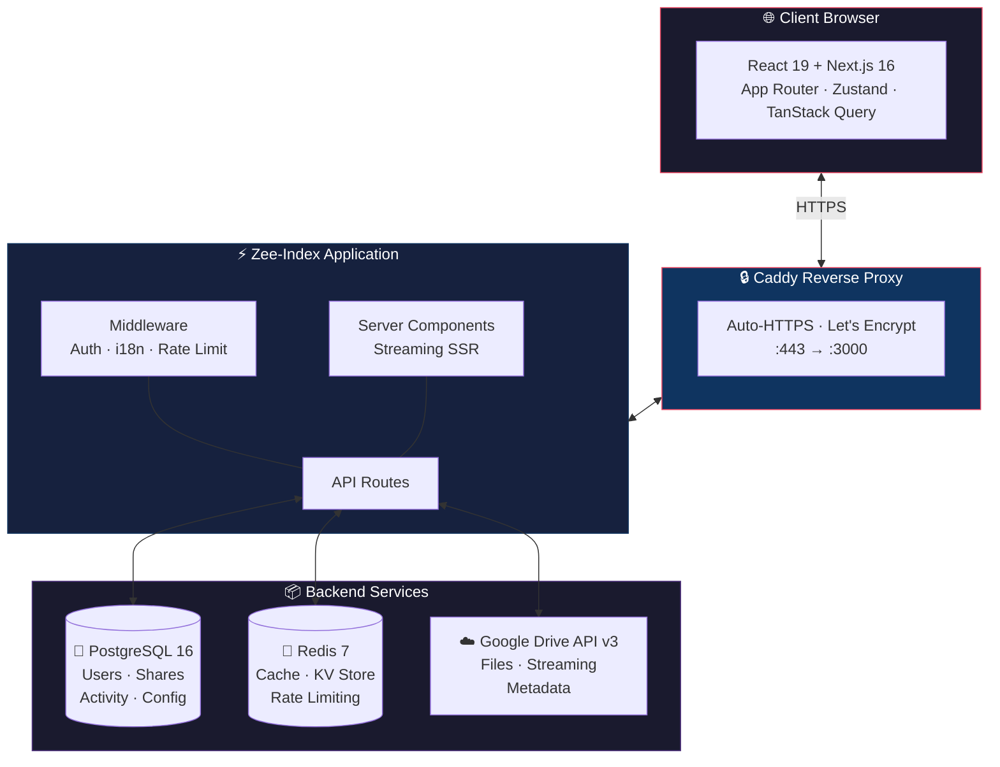

<div align="center">
  <a href="https://github.com/ifauzeee/Zee-Index">
    
  </a>

  <h1 align="center">⚡ Zee-Index</h1>

  <p align="center">
    <strong>Self-Hosted Google Drive Explorer, CMS & Streaming Platform</strong>
  </p>

  <p align="center">
    Transform your Google Drive into a professional file manager, media gallery, and streaming server.<br>
    <strong>Shared Drive</strong> management · <strong>Video Streaming</strong> · <strong>Password-Protected Folders</strong> · <strong>Share Links</strong>
  </p>

  <div align="center">
    <a href="https://zee-index.duckdns.org"></a>
    <a href="https://github.com/ifauzeee/Zee-Index/issues"></a>
    <a href="https://github.com/ifauzeee/Zee-Index/pulls"></a>
  </div>

  <br />

  <div align="center">
    
    
    
    
    
    
    
  </div>
</div>

<br />

---

## 📑 Table of Contents

<details>
<summary>Click to expand</summary>

- [Key Features](#-key-features)
- [Tech Stack](#️-tech-stack)
- [Architecture Overview](#-architecture-overview)
- [Getting Started](#-getting-started)
  - [Prerequisites](#prerequisites)
  - [Quick Start with Docker (Recommended)](#-quick-start-with-docker-recommended)
  - [Local Development](#-local-development)
- [Google Cloud Setup](#-google-cloud-setup)
- [Environment Variables](#️-environment-variables)
- [Deployment Guide](#-deployment-guide)
  - [VPS / DigitalOcean](#vps--digitalocean)
  - [Auto HTTPS with DuckDNS + Caddy](#automatic-https-with-duckdns--caddy)
  - [Railway / Render / Vercel](#other-platforms)
- [Security](#-security)
  - [Authentication & Authorization](#authentication--authorization)
  - [Password Hashing (bcrypt)](#password-hashing-bcrypt)
  - [Security Headers & CSP](#security-headers--csp)
- [API Reference](#-api-reference)
- [Keyboard Shortcuts](#️-keyboard-shortcuts)
- [Internationalization (i18n)](#-internationalization-i18n)
- [Project Structure](#-project-structure)
- [Testing](#-testing)
- [Troubleshooting](#️-troubleshooting)
- [Contributing](#-contributing)
- [License](#-license)
- [Acknowledgments](#-acknowledgments)

</details>

---

## 🌟 Key Features

### ⚡ Performance & UI

| Feature | Description |
|---|---|
| **Virtualized Rendering** | Smooth scrolling through **10,000+ files** with `@tanstack/react-virtual` |
| **Smart Prefetching** | Preloads folder contents on hover for instant navigation |
| **Multi-Layer Caching** | Redis + in-memory cache for blazing-fast API responses |
| **Turbopack** | Next.js 16 Turbopack for ultra-fast development builds |
| **PWA Support** | Installable as a Progressive Web App with offline caching |
| **Dark/Light Mode** | Automatic theme detection with manual toggle |

### 🎬 Media & File Previews

| Feature | Description |
|---|---|
| **Video Streaming** | Direct stream with VidStack player, resume playback, theater mode |
| **Auto Subtitles** | Automatic `.srt` / `.vtt` subtitle detection and loading |
| **Audio Dock** | Persistent audio player that continues across navigation |
| **Image Gallery** | Masonry grid with lightbox using `yet-another-react-lightbox` |
| **PDF Viewer** | Built-in viewer powered by `react-pdf` |
| **Code Editor** | Monaco Editor for syntax-highlighted code preview |
| **Office Files** | Preview Word, Excel, PowerPoint via Google Viewer |
| **Archive Preview** | Browse ZIP contents without downloading |
| **Ebook Reader** | Read ePub files in-browser |

### 🛡️ Security & Access Control

| Feature | Description |
|---|---|
| **Role-Based Access** | Admin / Editor / User / Guest roles |
| **Folder Passwords** | Recursive folder protection with bcrypt-hashed passwords |
| **Two-Factor Auth** | Optional TOTP-based 2FA with QR code setup |
| **Share Links** | JWT-signed links with expiry, max uses, download prevention, watermarks |
| **Rate Limiting** | Per-endpoint rate limiting for API, admin, auth, and download |
| **CSP Headers** | Content Security Policy, HSTS, X-Frame-Options, and more |
| **bcrypt Passwords** | Timing-safe password comparison with bcrypt hashing |

### 🗂️ Drive Management

| Feature | Description |
|---|---|
| **Multi-Drive Support** | Personal, Shared, and Team Drives in unified sidebar |
| **Manual Drives** | Add drives via config with optional password protection |
| **Folder Aliases** | Custom display names without modifying Google Drive |
| **Private Folders** | Hide specific folders from non-admin users |
| **Favorites** | Pin files and folders for quick access |
| **Drag & Drop** | Move files between folders via drag and drop |
| **Bulk Operations** | Multi-select, bulk download (ZIP), bulk delete |

### 🛠️ Admin Dashboard

| Feature | Description |
|---|---|
| **Analytics** | Page views, visitors, bandwidth, device breakdown |
| **Activity Logs** | Track downloads, uploads, config changes |
| **User Management** | Add editors, manage admin access via email |
| **Storage Monitor** | Real-time storage usage with warnings |
| **Cache Control** | Clear Redis cache, view cache stats |
| **System Health** | Monitor database, Redis, API health |
| **File Request** | Create public upload links |

---

## 🛠️ Tech Stack

<table>
<tr><th>Layer</th><th>Technology</th><th>Purpose</th></tr>
<tr><td rowspan="3"><strong>Frontend</strong></td><td>Next.js 16 + React 19</td><td>App Router, Server Components, Streaming SSR</td></tr>
<tr><td>Tailwind CSS + Framer Motion</td><td>Styling, glassmorphism, micro-animations</td></tr>
<tr><td>Zustand + TanStack Query</td><td>Global state + server state management</td></tr>
<tr><td rowspan="4"><strong>Backend</strong></td><td>Next.js API Routes</td><td>REST API with edge-compatible middleware</td></tr>
<tr><td>NextAuth.js v5 (Beta)</td><td>OAuth, credentials, guest auth, JWT sessions</td></tr>
<tr><td>Google Drive API v3</td><td>File storage, streaming, metadata</td></tr>
<tr><td>Prisma + PostgreSQL 16</td><td>Database ORM with migration support</td></tr>
<tr><td rowspan="2"><strong>Infrastructure</strong></td><td>Redis 7</td><td>Caching, rate limiting, session data</td></tr>
<tr><td>Docker + Caddy</td><td>Containerization, auto-HTTPS reverse proxy</td></tr>
<tr><td rowspan="3"><strong>Dev Tools</strong></td><td>TypeScript 5 (strict)</td><td>Type safety across the entire codebase</td></tr>
<tr><td>Vitest + Playwright</td><td>Unit tests + end-to-end testing</td></tr>
<tr><td>ESLint + Prettier + Husky</td><td>Linting, formatting, git hooks</td></tr>
</table>

---

## 🏗 Architecture Overview


```mermaid
flowchart TB
    subgraph CLIENT["🌐 Client Browser"]
        A["React 19 + Next.js 16\nApp Router · Zustand · TanStack Query"]
    end

    subgraph CADDY["🔒 Caddy Reverse Proxy"]
        B["Auto-HTTPS · Let's Encrypt\n:443 → :3000"]
    end

    subgraph APP["⚡ Zee-Index Application"]
        C["API Routes"]
        D["Middleware\nAuth · i18n · Rate Limit"]
        E["Server Components\nStreaming SSR"]
    end

    subgraph SERVICES["📦 Backend Services"]
        F[("🐘 PostgreSQL 16\nUsers · Shares\nActivity · Config")]
        G[("🔴 Redis 7\nCache · KV Store\nRate Limiting")]
        H["☁️ Google Drive API v3\nFiles · Streaming\nMetadata"]
    end

    CLIENT <-->|HTTPS| CADDY
    CADDY <--> APP
    C <--> F
    C <--> G
    C <--> H
    D --- C
    E --- C

    style CLIENT fill:#1a1a2e,stroke:#e94560,color:#fff
    style CADDY fill:#0f3460,stroke:#e94560,color:#fff
    style APP fill:#16213e,stroke:#0f3460,color:#fff
    style SERVICES fill:#1a1a2e,stroke:#533483,color:#fff
```

> **Live Demo:** [https://zee-index.duckdns.org](https://zee-index.duckdns.org)

---

## 🚀 Getting Started

### Prerequisites

| Requirement | Version | Required |
|---|---|---|
| [Docker](https://docs.docker.com/get-docker/) + Docker Compose | Latest | ✅ Yes |
| [Git](https://git-scm.com/) | Latest | ✅ Yes |
| [Node.js](https://nodejs.org/) + pnpm | 20.x+ / 9.x+ | 🔶 Only for local dev |
| Google Cloud Project | — | ✅ Yes |

### 🐳 Quick Start with Docker (Recommended)

The fastest way to get Zee-Index running with **PostgreSQL**, **Redis**, **auto-HTTPS**, all preconfigured:

```bash
# 1. Clone the repository
git clone https://github.com/ifauzeee/Zee-Index.git
cd Zee-Index

# 2. Copy environment template
cp .env.example .env

# 3. Edit .env with your credentials (see Environment Variables section)
nano .env

# 4. Build and start all services
docker compose up -d --build

# 5. Open http://localhost:3000 (or your domain)
#    Navigate to /setup to complete Google Drive configuration
```

**Useful Docker commands:**

```bash
# View logs
docker compose logs -f zee-index

# Restart after .env changes
docker compose up -d

# Rebuild after code changes
docker compose up -d --build

# Stop all services
docker compose down

# Stop and remove all data (⚠️ destructive)
docker compose down -v
```

### 💻 Local Development

For contributors or those who prefer local development with hot reload:

```bash
# 1. Clone and install
git clone https://github.com/ifauzeee/Zee-Index.git
cd Zee-Index
pnpm install

# 2. Configure environment
cp .env.example .env
# Edit .env — set DATABASE_URL for a local PostgreSQL instance

# 3. Setup database
pnpm prisma migrate deploy   # or: pnpm prisma db push

# 4. Start Redis (optional but recommended)
docker run -d --name zee-redis -p 6379:6379 redis:7-alpine

# 5. Start development server (with Turbopack)
pnpm dev

# 6. Open http://localhost:3000
```

**Development commands:**

```bash
pnpm dev              # Start with Turbopack (fast)
pnpm dev:webpack      # Start with Webpack (fallback)
pnpm build            # Production build
pnpm typecheck        # TypeScript type checking
pnpm lint             # ESLint
pnpm format:check     # Prettier check
pnpm check:all        # Run all checks
pnpm test             # Unit tests (Vitest)
pnpm test:e2e         # E2E tests (Playwright)
```

---

## ☁️ Google Cloud Setup

<details>
<summary><strong>Step-by-step Google Cloud configuration</strong></summary>

### 1. Create a Google Cloud Project

1. Go to [Google Cloud Console](https://console.cloud.google.com/)
2. Create a new project (or select an existing one)

### 2. Enable Google Drive API

1. Navigate to **APIs & Services** → **Library**
2. Search for **"Google Drive API"**
3. Click **Enable**

### 3. Configure OAuth Consent Screen

1. Go to **APIs & Services** → **OAuth consent screen**
2. Select **External** user type
3. Fill in app name, support email, developer email
4. Add scopes:
   - `https://www.googleapis.com/auth/drive`
   - `https://www.googleapis.com/auth/drive.file`
   - `https://www.googleapis.com/auth/userinfo.email`
   - `https://www.googleapis.com/auth/userinfo.profile`
5. Add your email as a test user (while in testing mode)

### 4. Create OAuth 2.0 Credentials

1. Go to **APIs & Services** → **Credentials**
2. Click **Create Credentials** → **OAuth client ID**
3. Select **Web application**
4. Add **Authorized redirect URIs**:
   - `http://localhost:3000/setup` (development)
   - `https://yourdomain.com/setup` (production)
5. Save the **Client ID** and **Client Secret**

### 5. Obtain Refresh Token

1. Set `GOOGLE_CLIENT_ID` and `GOOGLE_CLIENT_SECRET` in `.env`
2. Leave `GOOGLE_REFRESH_TOKEN` empty
3. Start the application and navigate to `/setup`
4. Complete the OAuth flow → copy the **Refresh Token**
5. Add it to `.env` as `GOOGLE_REFRESH_TOKEN`
6. Restart the application

</details>

---

## ⚙️ Environment Variables

### Required Variables

| Variable | Description | Example |
|---|---|---|
| `NEXTAUTH_URL` | Your application URL | `https://yourdomain.com` |
| `NEXTAUTH_SECRET` | Encryption key (min 32 chars) | `openssl rand -base64 32` |
| `GOOGLE_CLIENT_ID` | Google OAuth Client ID | `xxx.apps.googleusercontent.com` |
| `GOOGLE_CLIENT_SECRET` | Google OAuth Client Secret | `GOCSPX-xxx` |
| `GOOGLE_REFRESH_TOKEN` | OAuth Refresh Token | Obtained via `/setup` |
| `NEXT_PUBLIC_ROOT_FOLDER_ID` | Root Google Drive folder ID | `1ABcDeFgHiJkLmNoPqRsT` |
| `ADMIN_EMAILS` | Comma-separated admin emails | `admin@example.com` |
| `ADMIN_PASSWORD` | Admin fallback login password | Use a strong password |
| `SHARE_SECRET_KEY` | JWT signing key (min 32 chars) | `openssl rand -base64 32` |

### Database & Cache

| Variable | Description | Default |
|---|---|---|
| `POSTGRES_USER` | PostgreSQL username | `postgres` |
| `POSTGRES_PASSWORD` | PostgreSQL password | `postgres` |
| `POSTGRES_DB` | Database name | `zee_index` |
| `DATABASE_URL` | Full connection string (non-Docker) | Auto-generated in Docker |
| `REDIS_URL` | Redis connection string | `redis://redis:6379` (Docker) |

### Optional Variables

| Variable | Description | Default |
|---|---|---|
| `ADMIN_PASSWORD_HASH` | bcrypt hash of admin password (recommended) | — |
| `NEXT_PUBLIC_ROOT_FOLDER_NAME` | Display name for root folder | `Home` |
| `NEXT_PUBLIC_MANUAL_DRIVES` | JSON array of additional drives | `[]` |
| `PRIVATE_FOLDER_IDS` | JSON array of private folder IDs | `[]` |
| `STORAGE_LIMIT_GB` | Storage warning limit | `15` |
| `STORAGE_WARNING_THRESHOLD` | Warning threshold (0–1) | `0.90` |
| `CRON_SECRET` | Cron job authentication token | — |
| `TMDB_API_KEY` | TMDB API key for movie metadata | — |
| `DUCKDNS_DOMAIN` | DuckDNS subdomain | — |
| `DUCKDNS_TOKEN` | DuckDNS authentication token | — |

### Email Configuration (Optional)

| Variable | Description | Default |
|---|---|---|
| `SMTP_HOST` | SMTP server | `smtp.gmail.com` |
| `SMTP_PORT` | SMTP port | `465` |
| `SMTP_USER` | SMTP username | — |
| `SMTP_PASS` | SMTP password / app password | — |
| `EMAIL_FROM` | Sender email address | `Zee Index <no-reply@example.com>` |

<details>
<summary><strong>📋 Complete .env template</strong></summary>

```bash
# ==============================================================================
# ZEE-INDEX CONFIGURATION
# ==============================================================================

# 1. CORE
NEXTAUTH_URL="http://localhost:3000"
NEXTAUTH_SECRET=""          # openssl rand -base64 32
SHARE_SECRET_KEY=""         # openssl rand -base64 32

ADMIN_EMAILS="admin@example.com"
ADMIN_PASSWORD="your-secure-password"
# ADMIN_PASSWORD_HASH=""    # Generate: scripts/hash-password.sh "password"

# 2. GOOGLE DRIVE
GOOGLE_CLIENT_ID=""
GOOGLE_CLIENT_SECRET=""
GOOGLE_REFRESH_TOKEN=""
NEXT_PUBLIC_ROOT_FOLDER_ID=""
NEXT_PUBLIC_ROOT_FOLDER_NAME="Home"

# 3. DATABASE (Docker auto-configures DATABASE_URL)
POSTGRES_USER=postgres
POSTGRES_PASSWORD=postgres
POSTGRES_DB=zee_index

# 4. LIMITS & MONITORING
STORAGE_LIMIT_GB=15
STORAGE_WARNING_THRESHOLD=0.90
CRON_SECRET="random-string"

# 5. BUILD
SKIP_ENV_VALIDATION=false

# 6. HTTPS (Optional)
# DUCKDNS_DOMAIN="your-subdomain"
# DUCKDNS_TOKEN="your-token"

# 7. EMAIL (Optional)
# SMTP_HOST="smtp.gmail.com"
# SMTP_PORT="465"
# SMTP_USER="your-email@gmail.com"
# SMTP_PASS="your-app-password"
# EMAIL_FROM="Zee Index <no-reply@example.com>"

# 8. EXTERNAL SERVICES (Optional)
# TMDB_API_KEY=""
```

</details>

---

## 📦 Deployment Guide

### VPS / DigitalOcean

Zee-Index is optimized for deployment on low-resource VPS instances (1 CPU / 1 GB RAM):

```bash
# 1. SSH into your server
ssh root@your-server-ip

# 2. Install Docker
curl -fsSL https://get.docker.com | sh

# 3. Create a non-root user (recommended)
adduser zee && usermod -aG docker zee
su - zee

# 4. Clone and configure
git clone https://github.com/ifauzeee/Zee-Index.git
cd Zee-Index
cp .env.example .env
nano .env  # Configure all required variables

# 5. Deploy
docker compose up -d --build

# 6. Verify
docker compose ps        # All containers should be "healthy"
docker compose logs -f   # Watch startup logs
```

**Resource usage (approximate):**

| Container | Memory Limit | Typical Usage |
|---|---|---|
| `zee-index` | 512 MB | ~300 MB |
| `postgres` | 200 MB | ~50 MB |
| `redis` | 150 MB | ~20 MB |
| `caddy` | 50 MB | ~10 MB |
| **Total** | **~912 MB** | **~380 MB** |

### Automatic HTTPS with DuckDNS + Caddy

The included `docker-compose.yml` has built-in support for **free HTTPS**:

1. **Get a DuckDNS domain** at [duckdns.org](https://www.duckdns.org/)
2. **Add to `.env`:**
   ```bash
   DUCKDNS_DOMAIN="your-subdomain"
   DUCKDNS_TOKEN="your-duckdns-token"
   NEXTAUTH_URL="https://your-subdomain.duckdns.org"
   ```
3. **Create a `Caddyfile`:**
   ```
   your-subdomain.duckdns.org {
     reverse_proxy zee-index:3000
   }
   ```
4. **Deploy** — Caddy automatically provisions SSL via Let's Encrypt

### Other Platforms

<details>
<summary><strong>Railway</strong></summary>

1. Create a project at [railway.app](https://railway.app/)
2. Add **PostgreSQL** and **Redis** services
3. Connect your GitHub repository
4. Set environment variables
5. Deploy

</details>

<details>
<summary><strong>Render</strong></summary>

1. Create a Web Service at [render.com](https://render.com/)
2. Build command: `pnpm install && pnpm prisma migrate deploy && pnpm build`
3. Start command: `pnpm start`
4. Add PostgreSQL database and Redis instances
5. Set environment variables

</details>

---

## 🔐 Security

### Authentication & Authorization

| Method | Description | Config |
|---|---|---|
| **Google OAuth** | Login with Google account | Set OAuth credentials |
| **Admin Password** | Email + password login for admins | `ADMIN_EMAILS` + `ADMIN_PASSWORD` |
| **Guest Access** | Read-only access (can be disabled) | Toggle in admin settings |
| **Two-Factor Auth** | TOTP-based 2FA with QR code | Admin dashboard setup |

**Role Hierarchy:**

| Role | Permissions |
|---|---|
| `ADMIN` | Full access — settings, user management, all files |
| `EDITOR` | Can manage files but not system settings |
| `USER` | Standard access to permitted folders |
| `GUEST` | Read-only access to public content |

### Password Hashing (bcrypt)

Admin passwords support **bcrypt hashing** for production security:

```bash
# Generate a bcrypt hash for your password
docker compose exec zee-index sh /app/scripts/hash-password.sh "your-password"

# Add the output to .env
ADMIN_PASSWORD_HASH=$2a$10$...your-hash-here...

# You can then remove the plaintext ADMIN_PASSWORD
```

> **Migration path:** If `ADMIN_PASSWORD_HASH` is set, bcrypt is used. Otherwise, the system falls back to timing-safe comparison of `ADMIN_PASSWORD`.

### Security Headers & CSP

Zee-Index includes comprehensive security headers:

- **Content-Security-Policy** — Prevents XSS by restricting script/style/media sources
- **Strict-Transport-Security** — Forces HTTPS (63072000s / ~2 years)
- **X-Frame-Options: DENY** — Prevents clickjacking
- **X-Content-Type-Options: nosniff** — Prevents MIME sniffing
- **Referrer-Policy** — `strict-origin-when-cross-origin`
- **Permissions-Policy** — Disables camera, microphone, geolocation

---

## 📖 API Reference

### Public Endpoints

| Method | Endpoint | Description |
|---|---|---|
| `GET` | `/api/health` | Health check |
| `GET` | `/api/config/public` | Public app configuration |
| `GET` | `/api/files` | List files (with optional share token) |
| `GET` | `/api/download?fileId=…` | Download / stream file |
| `GET` | `/api/folderpath?folderId=…` | Get folder breadcrumb path |
| `GET` | `/api/metadata?fileId=…` | Get file metadata |

### Authenticated Endpoints

| Method | Endpoint | Description |
|---|---|---|
| `GET` | `/api/search?q=…` | Search files |
| `GET` | `/api/datausage` | Storage usage info |
| `POST` | `/api/favorites` | Toggle favorites |
| `POST` | `/api/tags` | Manage file tags |
| `POST` | `/api/share/create` | Create share link |

### Admin Endpoints

| Method | Endpoint | Description |
|---|---|---|
| `GET` | `/api/admin/analytics` | Analytics data |
| `GET` | `/api/admin/activity` | Activity logs |
| `GET` | `/api/admin/cache-stats` | Cache statistics |
| `POST` | `/api/admin/config` | Update app configuration |
| `POST` | `/api/admin/2fa/setup` | Configure 2FA |
| `POST` | `/api/admin/protected-folders` | Manage folder passwords |
| `POST` | `/api/admin/manual-drives` | Manage drives |
| `DELETE` | `/api/admin/clearcache` | Clear all caches |

---

## ⌨️ Keyboard Shortcuts

| Shortcut | Action |
|---|---|
| <kbd>Ctrl</kbd>/<kbd>⌘</kbd> + <kbd>K</kbd> | Open Command Palette |
| <kbd>/</kbd> | Focus Search |
| <kbd>Space</kbd> | Quick Preview |
| <kbd>Ctrl</kbd> + <kbd>A</kbd> | Select All Files |
| <kbd>Delete</kbd> | Delete Selected |
| <kbd>F2</kbd> | Rename Selected |
| <kbd>Enter</kbd> | Open Selected Item |
| <kbd>Escape</kbd> | Close Modal / Clear Selection |
| <kbd>G</kbd> then <kbd>H</kbd> | Go to Home |

---

## 🌍 Internationalization (i18n)

Zee-Index supports multiple languages via `next-intl`:

| Language | Code | Status |
|---|---|---|
| 🇬🇧 English | `en` | ✅ Complete |
| 🇮🇩 Indonesian | `id` | ✅ Complete |

**Adding a new language:**

1. Copy `messages/en.json` → `messages/xx.json`
2. Translate all strings
3. Add `"xx"` to the locales array in `middleware.ts`:
   ```typescript
   const intlMiddleware = createMiddleware({
     locales: ["en", "id", "xx"],
     defaultLocale: "en",
   });
   ```

---

## 📂 Project Structure

```
zee-index/
├── app/                          # Next.js App Router
│   ├── [locale]/                 # Internationalized routes
│   │   ├── (main)/               # Main layout (sidebar + content)
│   │   ├── admin/                # Admin dashboard
│   │   ├── login/                # Login page
│   │   └── setup/                # Setup wizard
│   └── api/                      # API Routes
│       ├── admin/                # Admin-only APIs
│       ├── auth/                 # NextAuth handlers
│       ├── download/             # File download & streaming
│       ├── files/                # File listing
│       ├── share/                # Share link APIs
│       └── cron/                 # Scheduled tasks
│
├── components/                   # React Components
│   ├── admin/                    # Admin dashboard UI
│   ├── file-browser/             # File listing, actions, modals
│   │   ├── share/                # Share modal components
│   │   └── details/              # Detail panel components
│   ├── file-details/             # File preview & player
│   │   └── video-player/         # Video overlays & controls
│   ├── layout/                   # Header, Sidebar, Footer
│   │   └── sidebar/              # Sidebar sub-components
│   ├── common/                   # Shared UI components
│   └── ui/                       # Radix-based primitives
│
├── lib/                          # Core Libraries
│   ├── drive/                    # Google Drive API client
│   ├── kv/                       # Redis/KV abstraction layer
│   │   ├── index.ts              # Factory + re-exports
│   │   ├── types.ts              # KVClient interface
│   │   ├── redis-kv.ts           # Redis implementation
│   │   └── memory-kv.ts          # In-memory fallback
│   ├── store/                    # Zustand state management
│   ├── services/                 # Business logic (download, etc.)
│   └── *.ts                      # Utils, auth, logger, ratelimit
│
├── hooks/                        # Custom React Hooks
├── types/                        # TypeScript definitions
├── messages/                     # i18n translations (en, id)
├── prisma/                       # Database schema & migrations
│   ├── schema.prisma
│   └── migrations/               # Prisma migration history
├── scripts/                      # Utility scripts
│   └── hash-password.sh          # bcrypt password hash generator
│
├── docker-compose.yml            # Production stack
├── Dockerfile                    # Multi-stage optimized build
├── Caddyfile                     # Reverse proxy config
├── middleware.ts                  # Auth, i18n, rate limiting
└── next.config.mjs               # Next.js + security headers
```

---

## 🧪 Testing

### Unit Tests (Vitest)

```bash
pnpm test                  # Run all tests
pnpm test -- --watch       # Watch mode
pnpm test -- --coverage    # Coverage report
```

### End-to-End Tests (Playwright)

```bash
npx playwright install     # Install browsers (first time)
pnpm test:e2e              # Run E2E tests
npx playwright test --ui   # Run with interactive UI
npx playwright show-report # View HTML report
```

---

## ⚠️ Troubleshooting

<details>
<summary><strong>🔴 Container fails to start ("unhealthy")</strong></summary>

```bash
# Check logs for errors
docker compose logs zee-index --tail 50

# Common causes:
# 1. Database not ready — increase start_period in healthcheck
# 2. Missing .env variables — check all required vars are set
# 3. Port conflict — ensure 3000, 5432, 6379 are free
```
</details>

<details>
<summary><strong>🔴 Login fails</strong></summary>

1. Verify `ADMIN_EMAILS` matches your email **exactly** (case-insensitive)
2. Check `ADMIN_PASSWORD` has no surrounding quotes in `.env`
3. For bcrypt: ensure `ADMIN_PASSWORD_HASH` is a valid bcrypt hash
4. Clear browser cookies and retry
5. Check `docker compose logs zee-index` for `[Auth]` messages
</details>

<details>
<summary><strong>🔴 Google Drive API errors (401/403)</strong></summary>

1. Verify `GOOGLE_REFRESH_TOKEN` is valid
2. Re-run `/setup` flow to obtain a new token
3. Check API quota at [Google Cloud Console](https://console.cloud.google.com/apis/dashboard)
4. Ensure the Google account has access to the target folders
</details>

<details>
<summary><strong>🟡 Slow performance</strong></summary>

1. Enable Redis (don't rely on in-memory fallback)
2. Check Google Drive API quota (default: 12,000 requests/min)
3. Monitor with `docker compose exec zee-index sh -c "cat /proc/1/status | grep VmRSS"`
4. Increase memory limit if needed: `NODE_OPTIONS=--max-old-space-size=512`
</details>

<details>
<summary><strong>🟡 Build fails in Docker</strong></summary>

```bash
# Build without cache
docker compose build --no-cache

# Check disk space
df -h

# Ensure SKIP_ENV_VALIDATION=true is set for builds without full .env
```
</details>

<details>
<summary><strong>🟡 Database migration issues</strong></summary>

```bash
# Check migration status
docker compose exec zee-index npx prisma migrate status

# Force apply migration
docker compose exec zee-index npx prisma migrate deploy

# Reset database (⚠️ destructive)
docker compose exec zee-index npx prisma migrate reset
```
</details>

---

## 🤝 Contributing

Contributions are welcome! Here's how to get started:

```bash
# 1. Fork and clone
git clone https://github.com/YOUR_USERNAME/Zee-Index.git
cd Zee-Index

# 2. Create a feature branch
git checkout -b feat/amazing-feature

# 3. Install and develop
pnpm install && pnpm dev

# 4. Run all checks before committing
pnpm check:all

# 5. Commit with conventional format
git commit -m "feat: add amazing feature"

# 6. Push and open a Pull Request
git push origin feat/amazing-feature
```

**Commit Convention** ([Conventional Commits](https://www.conventionalcommits.org/)):

| Prefix | Usage |
|---|---|
| `feat:` | New feature |
| `fix:` | Bug fix |
| `refactor:` | Code restructuring |
| `security:` | Security improvement |
| `docs:` | Documentation |
| `chore:` | Maintenance |
| `test:` | Adding/updating tests |

---

## 📜 License

This project is licensed under the **GNU Affero General Public License v3.0 (AGPL-3.0)** with an attribution requirement.

- ✅ Free to use, modify, and distribute
- ✅ Commercial use allowed
- ⚠️ **Attribution required:** display `© 2025 Muhammad Ibnu Fauzi` in your deployment
- ⚠️ Modified versions that are hosted must share source code
- ⚠️ Changes must be documented

See the [LICENSE](LICENSE) file for full details.

---

## 🙏 Acknowledgments

Built with these amazing open-source projects:

- [Next.js](https://nextjs.org/) — The React framework
- [VidStack](https://www.vidstack.io/) — Video player components
- [Radix UI](https://www.radix-ui.com/) — Accessible UI primitives
- [TanStack](https://tanstack.com/) — React Query & Virtual
- [Framer Motion](https://www.framer.com/motion/) — Animation library
- [Zustand](https://zustand-demo.pmnd.rs/) — State management
- [Prisma](https://www.prisma.io/) — Database ORM
- [Lucide](https://lucide.dev/) — Beautiful icons

---

<div align="center">
  <br />
  <p>
    <strong>⭐ If you find this project useful, please give it a star!</strong>
  </p>
  <br />
  <p>
    Crafted with ❤️ by <a href="https://github.com/ifauzeee">Muhammad Ibnu Fauzi</a>
  </p>
  <p>
    <a href="https://github.com/ifauzeee/Zee-Index">GitHub</a>
    ·
    <a href="https://zee-index.duckdns.org">Live Demo</a>
    ·
    <a href="https://github.com/ifauzeee/Zee-Index/issues">Issues</a>
  </p>
</div>
