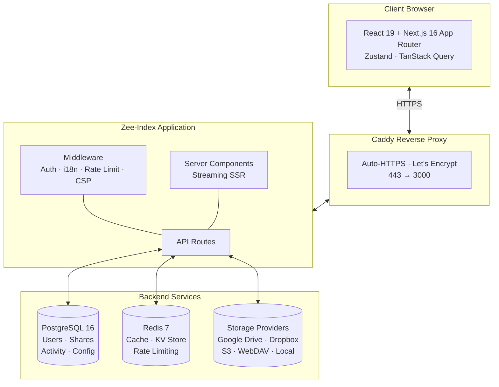

<div align="center">
  <a href="https://github.com/ifauzeee/Zee-Index">
    
  </a>

  <h1 align="center">Zee-Index</h1>

  <p align="center">
    Self-hosted file explorer and media streaming platform.
    One unified interface over Google Drive, Dropbox, S3/R2, WebDAV, and local storage.
  </p>

  <p align="center">
    <a href="https://github.com/ifauzeee/Zee-Index/stargazers">
      
    </a>
    <a href="https://github.com/ifauzeee/Zee-Index/forks">
      
    </a>
    <a href="LICENSE">
      
    </a>
    <a href="https://ifauzeee.vercel.app/projects/zee-index/preview">
      
    </a>
  </p>

  <p align="center">
    
    
    
    
    
    
    
    
    
  </p>
</div>

---

## Contents

- [Key Features](#key-features)
- [Tech Stack](#tech-stack)
- [Architecture](#architecture)
- [Getting Started](#getting-started)
- [Storage Providers](#storage-providers)
- [Google Cloud Setup](#google-cloud-setup)
- [Environment Variables](#environment-variables)
- [Deployment](#deployment)
- [Security](#security)
- [API Reference](#api-reference)
- [Project Structure](#project-structure)
- [Development & Testing](#development--testing)
- [FAQ & Troubleshooting](docs/FAQ.md)
- [Contributing](#contributing)
- [License](#license)

---

## Key Features

### Storage

| Feature                 | Description                                                     |
| ----------------------- | --------------------------------------------------------------- |
| **Multi-provider**      | Google Drive, Dropbox, S3/R2, WebDAV, and local filesystem      |
| **Unified root**        | All providers appear under one virtual root in the file browser |
| **Multi-drive support** | Personal, Shared, and Team Drives in a single sidebar           |
| **Manual drives**       | Additional Google Drive mounts via config, optional password    |
| **Folder aliases**      | Custom display names without touching the source drive          |
| **Private folders**     | Hide specific folders from non-admin users                      |
| **Local storage**       | Mount a local directory alongside cloud providers               |
| **Storage monitor**     | Usage limits and warnings per provider                          |

### Media Playback

| Feature                 | Description                                                       |
| ----------------------- | ----------------------------------------------------------------- |
| **Video streaming**     | Direct streaming with VidStack player, resume, picture-in-picture |
| **Adaptive subtitles**  | Auto-detected `.srt` / `.vtt` subtitles                           |
| **Audio dock**          | Persistent player that keeps playing across navigation            |
| **Image gallery**       | Masonry grid with a full-featured lightbox                        |
| **Inline image editor** | Crop, resize, rotate with `react-easy-crop`                       |
| **PDF viewer**          | Built-in viewer powered by `react-pdf`                            |
| **Code viewer**         | Monaco Editor with syntax highlighting and read-only preview      |
| **Office files**        | Word, Excel, and PowerPoint preview via Google Viewer             |
| **Archive preview**     | Browse ZIP contents without downloading                           |
| **Ebook reader**        | Read `.epub` files in the browser                                 |
| **Movie metadata**      | Optional TMDB enrichment — posters, ratings, cast                 |
| **File tags**           | Custom, searchable tags on any file                               |

### Access Control

| Feature               | Description                                                                 |
| --------------------- | --------------------------------------------------------------------------- |
| **Role-based access** | Admin / Editor / User / Guest                                               |
| **Folder passwords**  | Recursive folder protection, bcrypt-hashed                                  |
| **Two-factor auth**   | Optional TOTP 2FA with QR setup                                             |
| **Share links**       | JWT-signed, with expiry, max uses, download toggle, watermark               |
| **Direct download**   | Share links that start the download without the preview page                |
| **Access requests**   | Users request access to protected folders; admin approves                   |
| **Rate limiting**     | Per-endpoint tiers for API, admin, auth, and download                       |
| **API keys**          | Bearer `zk_...` keys with granular `files:read` / `admin:write` permissions |
| **Security headers**  | CSP (nonce-based), HSTS, X-Frame-Options, Referrer/Feature Policy           |

### Admin Dashboard

| Feature                  | Description                                         |
| ------------------------ | --------------------------------------------------- |
| **Analytics**            | Page views, visitors, bandwidth, device breakdown   |
| **Activity & audit log** | Downloads, uploads, config changes, security events |
| **User management**      | Editors, invites, password resets                   |
| **Incident monitoring**  | Auto-checks with Discord / Telegram alerts          |
| **Cache control**        | Inspect and clear Redis cache                       |
| **System health**        | DB, Redis, and API health checks                    |
| **File requests**        | Public upload links with expiry                     |
| **Storage tests**        | Validate provider connections from the panel        |

---

## Tech Stack

<table>
<tr><th>Layer</th><th>Technology</th><th>Purpose</th></tr>
<tr><td rowspan="3"><strong>Frontend</strong></td><td>Next.js 16 + React 19</td><td>App Router, Server Components, Streaming SSR</td></tr>
<tr><td>Tailwind CSS 3 + Framer Motion</td><td>Styling and micro-animations</td></tr>
<tr><td>Zustand + TanStack Query</td><td>Client and server state</td></tr>
<tr><td rowspan="5"><strong>Backend</strong></td><td>Next.js API Routes</td><td>REST API, middleware, i18n routing</td></tr>
<tr><td>NextAuth.js v5</td><td>OAuth, credentials, guest auth, JWT sessions</td></tr>
<tr><td>Google Drive API v3</td><td>Primary file storage and streaming</td></tr>
<tr><td>Prisma + PostgreSQL 16</td><td>ORM with versioned migrations</td></tr>
<tr><td>ioredis + Redis 7</td><td>Caching, rate limiting, session state</td></tr>
<tr><td rowspan="3"><strong>Infrastructure</strong></td><td>Docker + Caddy</td><td>Containerization, auto-HTTPS proxy</td></tr>
<tr><td>Dropbox API / AWS SDK v3 / WebDAV</td><td>Secondary storage providers</td></tr>
<tr><td>Pino</td><td>Structured logging</td></tr>
<tr><td rowspan="2"><strong>Frontend tooling</strong></td><td>Vitest + Playwright</td><td>Unit and end-to-end tests</td></tr>
<tr><td>ESLint + Prettier + Husky</td><td>Linting, formatting, git hooks</td></tr>
</table>

---

## Architecture


```mermaid
flowchart TB
    subgraph CLIENT["Client Browser"]
        A["React 19 + Next.js 16 App Router<br/>Zustand · TanStack Query"]
    end

    subgraph CADDY["Caddy Reverse Proxy"]
        B["Auto-HTTPS · Let's Encrypt<br/>443 → 3000"]
    end

    subgraph APP["Zee-Index Application"]
        C["API Routes"]
        D["Middleware<br/>Auth · i18n · Rate Limit · CSP"]
        E["Server Components<br/>Streaming SSR"]
    end

    subgraph SERVICES["Backend Services"]
        F[("PostgreSQL 16<br/>Users · Shares<br/>Activity · Config")]
        G[("Redis 7<br/>Cache · KV Store<br/>Rate Limiting")]
        H[("Storage Providers<br/>Google Drive · Dropbox<br/>S3 · WebDAV · Local")]
    end

    CLIENT <-->|HTTPS| CADDY
    CADDY <--> APP
    C <--> F
    C <--> G
    C <--> H
    D --- C
    E --- C
```

---

## Getting Started

### Prerequisites

| Requirement                                       | Required                |
| ------------------------------------------------- | ----------------------- |
| [Docker](https://docs.docker.com/get-docker/) 26+ | Yes (recommended route) |
| [Git](https://git-scm.com/)                       | Yes                     |
| Node.js 20+ / pnpm 9+                             | Only for local dev      |
| Google Cloud project with the Drive API enabled   | Only for Google Drive   |

### Quick Start with Docker

```bash
# 1. Clone the repository
git clone https://github.com/ifauzeee/Zee-Index.git
cd Zee-Index

# 2. Configure environment
cp .env.example .env
$EDITOR .env   # set ADMIN_EMAILS, ADMIN_PASSWORD, secrets, folder IDs
               # there is no default password — you define it here

# 3. Build and start (PostgreSQL, Redis, Caddy included)
docker compose up -d --build

# 4. Open http://localhost:3000 and visit /setup
#    to authorize Google Drive / add storage providers
```

Useful commands:

```bash
docker compose ps                 # status of all services
docker compose logs -f zee-index  # stream application logs
docker compose up -d              # restart after .env changes
docker compose down -v            # stop and remove all data (destructive)
```

### Local Development

```bash
git clone https://github.com/ifauzeee/Zee-Index.git
cd Zee-Index
pnpm install

cp .env.example .env
# set DATABASE_URL for a local PostgreSQL instance

pnpm prisma migrate deploy        # or: pnpm prisma db push
docker run -d --name zee-redis -p 6379:6379 redis:7-alpine
pnpm dev                          # Turbopack dev server
```

Open `http://localhost:3000`. Log in with the `ADMIN_EMAILS` / `ADMIN_PASSWORD` you set.

**Scripts:**

| Command            | Purpose                                                   |
| ------------------ | --------------------------------------------------------- |
| `pnpm dev`         | Dev server (Turbopack)                                    |
| `pnpm dev:webpack` | Dev server (Webpack fallback)                             |
| `pnpm build`       | Production build                                          |
| `pnpm start`       | Production server                                         |
| `pnpm typecheck`   | `tsc --noEmit`                                            |
| `pnpm lint`        | ESLint                                                    |
| `pnpm check:all`   | typecheck + format:check + lint + i18n parity             |
| `pnpm test`        | Vitest unit tests                                         |
| `pnpm test:e2e`    | Playwright E2E tests (run `npx playwright install` first) |
| `pnpm analyze`     | Bundle analyzer                                           |
| `pnpm docker:dev`  | `docker compose -f docker-compose.dev.yml up`             |
| `pnpm docker:prod` | `docker compose up --build`                               |

---

## Storage Providers

Zee-Index serves files from **Google Drive** by default. You can mount **Dropbox**,
**S3 / Cloudflare R2**, or **WebDAV** (e.g. Nextcloud) in addition, or instead.
Files from each enabled provider appear under its own virtual root in the file
browser, side by side with other providers.

| Variable                        | Description                                                            | Default        |
| ------------------------------- | ---------------------------------------------------------------------- | -------------- |
| `STORAGE_PROVIDER`              | `google-drive`, `dropbox`, `s3`, or `webdav`                           | `google-drive` |
| `STORAGE_S3_ENDPOINT`           | S3-compatible endpoint (R2: `https://<acct>.r2.cloudflarestorage.com`) | —              |
| `STORAGE_S3_REGION`             | S3 region (R2: `auto`)                                                 | —              |
| `STORAGE_S3_BUCKET`             | Bucket name (required to enable S3)                                    | —              |
| `STORAGE_S3_ACCESS_KEY_ID`      | Access key ID                                                          | —              |
| `STORAGE_S3_SECRET_ACCESS_KEY`  | Secret access key                                                      | —              |
| `STORAGE_S3_FORCE_PATH_STYLE`   | Use path-style URLs (required for R2)                                  | `true`         |
| `STORAGE_S3_ROOT_NAME`          | Display name for the S3 root                                           | `S3 Storage`   |
| `STORAGE_WEBDAV_URL`            | WebDAV base URL (required to enable WebDAV)                            | —              |
| `STORAGE_WEBDAV_USERNAME`       | WebDAV username                                                        | —              |
| `STORAGE_WEBDAV_PASSWORD`       | WebDAV password                                                        | —              |
| `STORAGE_WEBDAV_BASEPATH`       | Base path on the server                                                | `/`            |
| `STORAGE_WEBDAV_ROOT_NAME`      | Display name for the WebDAV root                                       | `WebDAV`       |
| `STORAGE_DROPBOX_ACCESS_TOKEN`  | Dropbox access token (optional; app-key refresh supported)             | —              |
| `STORAGE_DROPBOX_REFRESH_TOKEN` | Dropbox refresh token (long-lived access)                              | —              |
| `STORAGE_DROPBOX_APP_KEY`       | Dropbox app key                                                        | —              |
| `STORAGE_DROPBOX_APP_SECRET`    | Dropbox app secret                                                     | —              |
| `STORAGE_DROPBOX_BASEPATH`      | Base path inside the Dropbox account                                   | —              |
| `STORAGE_DROPBOX_ROOT_NAME`     | Display name for the Dropbox root                                      | `Dropbox`      |

> Provider credentials are read from environment variables only and are never
> exposed to the browser or API responses — the admin **Storage** panel shows a
> masked summary and a "Test Connection" button. Restart the server after
> changing any storage variable.

### Google Cloud Setup

1. Create a project in the [Google Cloud Console](https://console.cloud.google.com/).
2. Enable the **Google Drive API**.
3. Configure an **OAuth consent screen** (External) with scopes:
   - `https://www.googleapis.com/auth/drive`
   - `https://www.googleapis.com/auth/drive.file`
   - `https://www.googleapis.com/auth/userinfo.email`
   - `https://www.googleapis.com/auth/userinfo.profile`
4. Create an **OAuth client ID** (Web application) with redirect URIs:
   - `http://localhost:3000/setup` (development)
   - `https://yourdomain.com/setup` (production)
5. Paste `GOOGLE_CLIENT_ID` / `GOOGLE_CLIENT_SECRET` into `.env`, leave
   `GOOGLE_REFRESH_TOKEN` empty, start the app, and complete the flow at
   `/setup` to obtain the refresh token. Add it to `.env` and restart.

---

## Environment Variables

### Required

| Variable                     | Description                               | Example                          |
| ---------------------------- | ----------------------------------------- | -------------------------------- |
| `NEXTAUTH_URL`               | Application URL                           | `https://yourdomain.com`         |
| `NEXTAUTH_SECRET`            | Session signing secret (min 32 chars)     | `openssl rand -base64 32`        |
| `GOOGLE_CLIENT_ID`           | Google OAuth client ID                    | `xxx.apps.googleusercontent.com` |
| `GOOGLE_CLIENT_SECRET`       | Google OAuth client secret                | `GOCSPX-...`                     |
| `GOOGLE_REFRESH_TOKEN`       | Google OAuth refresh token                | via `/setup`                     |
| `NEXT_PUBLIC_ROOT_FOLDER_ID` | Google Drive folder to expose (or `root`) | `1AbC...`                        |
| `ADMIN_EMAILS`               | Comma-separated admin emails              | `admin@example.com`              |
| `ADMIN_PASSWORD`             | Admin password — dev/local (min 8 chars)  | strong password                  |
| `ADMIN_PASSWORD_HASH`        | bcrypt hash, preferred in production      | `bcryptjs.hash(...)`             |
| `SHARE_SECRET_KEY`           | JWT signing key for share links (min 32)  | `openssl rand -base64 32`        |

Prefer `ADMIN_PASSWORD_HASH` over `ADMIN_PASSWORD` in production. Generate one with `scripts/hash-password.sh`.

> ⚠️ **Docker Compose deployments:** use plaintext `ADMIN_PASSWORD` instead. Compose
> interpolates `$` inside `.env` values, which silently corrupts bcrypt hashes
> (e.g. `$zh` in `$2b$10$zh.…` is read as the empty variable `${zh}`) and breaks
> admin login. See the FAQ: ["Why does admin login fail when deploying with Docker Compose?"](docs/FAQ.md).

### Database, Cache & Limits

| Variable                    | Description                    | Default                  |
| --------------------------- | ------------------------------ | ------------------------ |
| `POSTGRES_USER`             | PostgreSQL username            | `postgres`               |
| `POSTGRES_PASSWORD`         | PostgreSQL password            | `postgres`               |
| `POSTGRES_DB`               | Database name                  | `zee_index`              |
| `DATABASE_URL`              | Connection string (non-Docker) | Auto-generated in Docker |
| `REDIS_URL`                 | Redis connection string        | `redis://redis:6379`     |
| `STORAGE_LIMIT_GB`          | Storage warning limit          | `15`                     |
| `STORAGE_WARNING_THRESHOLD` | Warning threshold (0–1)        | `0.90`                   |
| `CRON_SECRET`               | Cron auth token (min 16 chars) | —                        |
| `ALLOWED_ORIGINS`           | Download origin allowlist      | —                        |
| `DOWNLOAD_TIMEOUT_MS`       | Download proxy timeout (ms)    | `60000`                  |

### Optional

| Variable                           | Description                                | Default                            |
| ---------------------------------- | ------------------------------------------ | ---------------------------------- |
| `NEXT_PUBLIC_APP_NAME`             | Application display name                   | `Zee Index`                        |
| `NEXT_PUBLIC_MANUAL_DRIVES`        | JSON array of extra drives                 | `[]`                               |
| `NEXT_PUBLIC_ENABLE_LOCAL_STORAGE` | Enable the local filesystem provider       | off                                |
| `PRIVATE_FOLDER_IDS`               | JSON array of private folder IDs           | `[]`                               |
| `LOG_LEVEL`                        | Pino level (`debug`/`info`/`warn`/`error`) | `info`                             |
| `TMDB_API_KEY`                     | Movie metadata enrichment                  | —                                  |
| `DUCKDNS_DOMAIN` / `DUCKDNS_TOKEN` | Free HTTPS via DuckDNS                     | —                                  |
| `NOTIFY_DISCORD_WEBHOOK`           | Incident alerts to Discord                 | —                                  |
| `NOTIFY_TELEGRAM_BOT_TOKEN`        | Incident alerts to Telegram                | —                                  |
| `NOTIFY_TELEGRAM_CHAT_ID`          | Telegram chat receiver                     | —                                  |
| `SMTP_HOST` / `SMTP_PORT`          | Outbound email (password reset, invites)   | `smtp.gmail.com` / `465`           |
| `SMTP_USER` / `SMTP_PASS`          | SMTP credentials                           | —                                  |
| `EMAIL_FROM`                       | Sender address                             | `Zee Index <no-reply@example.com>` |
| `SKIP_ENV_VALIDATION`              | Skip startup env checks (CI builds)        | `false`                            |

A complete, self-documenting template lives in [`.env.example`](.env.example).

---

## Deployment

### VPS (1 CPU / 1 GB minimum)

```bash
ssh root@your-server-ip
curl -fsSL https://get.docker.com | sh

adduser zee && usermod -aG docker zee
su - zee

git clone https://github.com/ifauzeee/Zee-Index.git
cd Zee-Index
cp .env.example .env
$EDITOR .env

docker compose up -d --build
docker compose ps          # all services should report "healthy"
```

> **Enabling the local storage provider on Docker Compose** — the app container
> runs as the `nextjs` user (uid 1001), and `./storage` is bind-mounted from the
> host. The host directory must be writable by uid 1001, or folder listings fail
> with `EACCES: permission denied, mkdir '/app/storage/.tmp'`. Fix the ownership
> once per host (run again after each fresh deploy):
>
> ```bash
> sudo chown -R 1001:1001 storage
> docker compose up -d zee-index
> ```

Typical footprint:

| Container   | Limit  | Typical |
| ----------- | ------ | ------- |
| `zee-index` | 512 MB | ~300 MB |
| `postgres`  | 200 MB | ~50 MB  |
| `redis`     | 150 MB | ~20 MB  |
| `caddy`     | 50 MB  | ~10 MB  |

### Automatic HTTPS (DuckDNS + Caddy)

The bundled `docker-compose.yml` and `Caddyfile` provision free Let's Encrypt certificates:

```bash
DUCKDNS_DOMAIN="your-subdomain"
DUCKDNS_TOKEN="your-duckdns-token"
CADDY_SITE="your-subdomain.duckdns.org"
NEXTAUTH_URL="https://your-subdomain.duckdns.org"
```

### Other Platforms

Zee-Index runs anywhere Next.js runs. General recipe:

1. Provision PostgreSQL 16 and Redis 7.
2. Deploy with `docker compose up -d --build` (or a PaaS build of your choice).
3. Set the environment variables above (`SKIP_ENV_VALIDATION=true` if the build
   runs without a full `.env`).
4. Run `prisma migrate deploy` before the first start (Docker does this automatically).

---

## Security

### Authentication

| Method            | Description                                  |
| ----------------- | -------------------------------------------- |
| Google OAuth      | Sign in with a Google account                |
| Admin credentials | `ADMIN_EMAILS` + `ADMIN_PASSWORD` / hash     |
| Guest access      | Read-only, can be disabled in admin settings |
| Two-factor auth   | TOTP with QR setup (admin)                   |

| Role   | Scope                                    |
| ------ | ---------------------------------------- |
| ADMIN  | Full access — settings, users, all files |
| EDITOR | File management, no system settings      |
| USER   | Standard access to permitted folders     |
| GUEST  | Read-only access to public content       |

### Headers & Policies

- **CSP** nonce-based — restrict script/style/media sources (applied in middleware)
- **HSTS** — forces HTTPS (2 years)
- **X-Frame-Options: DENY** — blocks clickjacking
- **X-Content-Type-Options: nosniff** — blocks MIME sniffing
- **Referrer-Policy** — `strict-origin-when-cross-origin`
- **Permissions-Policy** — camera, microphone, geolocation disabled

### API Keys

Programmatic access uses bearer keys (`Authorization: Bearer zk_...`) that bypass
session auth. Manage them at **Admin → API Keys** (`/admin/api-keys`); the raw
key is shown exactly once. Permissions are scoped: `files:read`, `files:write`,
`share:read`, `share:write`, `admin:read`, `admin:write`. Keys are bcrypt-hashed
at rest, use their own rate-limit tier, and can be revoked individually.

---

## API Reference

### Public

| Method | Endpoint                 | Description                       |
| ------ | ------------------------ | --------------------------------- |
| `GET`  | `/api/health`            | Health check                      |
| `GET`  | `/api/config/public`     | Public app configuration          |
| `GET`  | `/api/files`             | List files (optional share token) |
| `GET`  | `/api/filedetails`       | Single file details               |
| `GET`  | `/api/download?fileId=…` | Download / stream a file          |
| `GET`  | `/api/folderpath`        | Folder breadcrumb path            |
| `GET`  | `/api/metadata`          | File metadata                     |
| `GET`  | `/api/proxy-image`       | Secure image proxy for thumbnails |
| `GET`  | `/api/events`            | Server-sent events                |
| `POST` | `/api/analytics/track`   | Track page view                   |

### Authenticated

| Method | Endpoint                        | Description                    |
| ------ | ------------------------------- | ------------------------------ |
| `GET`  | `/api/search`                   | Search files                   |
| `GET`  | `/api/search/global`            | Search across all providers    |
| `GET`  | `/api/datausage`                | Storage usage                  |
| `GET`  | `/api/storage-details`          | Per-provider storage breakdown |
| `GET`  | `/api/trash`                    | Trashed files                  |
| `GET`  | `/api/manual-drives`            | Configured manual drives       |
| `GET`  | `/api/share/list`               | Share links                    |
| `GET`  | `/api/share/[id]`               | Share link details             |
| `GET`  | `/api/archive-preview`          | Browse ZIP contents            |
| `POST` | `/api/files/upload`             | Upload file                    |
| `POST` | `/api/files/move`               | Move file                      |
| `POST` | `/api/files/copy`               | Copy file                      |
| `POST` | `/api/files/delete`             | Delete file                    |
| `POST` | `/api/files/rename`             | Rename file                    |
| `POST` | `/api/files/update`             | Update file content            |
| `POST` | `/api/files/update-media`       | Update media metadata          |
| `POST` | `/api/files/bulk-delete`        | Bulk delete                    |
| `POST` | `/api/files/bulk-move`          | Bulk move                      |
| `POST` | `/api/files/[fileId]/revisions` | File revision history          |
| `POST` | `/api/folder/create`            | Create folder                  |
| `POST` | `/api/favorites`                | Toggle favorite                |
| `POST` | `/api/tags`                     | Manage file tags               |
| `POST` | `/api/share/create`             | Create share link              |
| `POST` | `/api/share/delete`             | Delete share link              |
| `POST` | `/api/share/revoke`             | Revoke share link              |
| `POST` | `/api/request-access`           | Request folder access          |
| `POST` | `/api/file-request/upload`      | Upload to a file request       |

### Admin

| Method   | Endpoint                        | Description              |
| -------- | ------------------------------- | ------------------------ |
| `GET`    | `/api/admin/analytics`          | Analytics data           |
| `GET`    | `/api/admin/audit`              | Security audit trail     |
| `GET`    | `/api/admin/logs`               | System logs              |
| `GET`    | `/api/admin/config`             | App configuration        |
| `GET`    | `/api/admin/incidents`          | Incidents                |
| `GET`    | `/api/admin/stats`              | System statistics        |
| `GET`    | `/api/admin/system-health`      | Health checks            |
| `GET`    | `/api/admin/storage/test`       | Test provider connection |
| `GET`    | `/api/admin/api-keys`           | List API keys (masked)   |
| `POST`   | `/api/admin/config`             | Update configuration     |
| `POST`   | `/api/admin/protected-folders`  | Folder passwords         |
| `POST`   | `/api/admin/manual-drives`      | Manage manual drives     |
| `POST`   | `/api/admin/invite`             | Invite user              |
| `POST`   | `/api/admin/editors`            | Add / remove editor      |
| `POST`   | `/api/admin/incidents/evaluate` | Evaluate incident rules  |
| `POST`   | `/api/admin/api-keys`           | Create API key           |
| `DELETE` | `/api/admin/api-keys/[id]`      | Revoke API key           |

### Auth & 2FA

| Method | Endpoint                     | Description                |
| ------ | ---------------------------- | -------------------------- |
| `GET`  | `/api/auth/me`               | Current user               |
| `GET`  | `/api/auth/status`           | Auth status                |
| `POST` | `/api/auth/2fa/generate`     | Secret + QR code           |
| `POST` | `/api/auth/2fa/verify`       | Verify 2FA setup           |
| `POST` | `/api/auth/2fa/verify-login` | Verify 2FA login           |
| `POST` | `/api/auth/2fa/disable`      | Disable 2FA                |
| `POST` | `/api/auth/folder`           | Authenticate folder access |
| `POST` | `/api/auth/profile/password` | Change own password        |

### Cron

| Method | Endpoint                     | Description             |
| ------ | ---------------------------- | ----------------------- |
| `GET`  | `/api/cron/activity-cleanup` | Purge old activity logs |
| `GET`  | `/api/cron/incident-monitor` | Run incident checks     |
| `GET`  | `/api/cron/storage-check`    | Check storage limits    |
| `GET`  | `/api/cron/weekly-report`    | Weekly activity report  |

Cron routes require `Authorization: Bearer $CRON_SECRET`.

---

## Project Structure

```
app/
  [locale]/            Internationalized routes (main, admin, login, setup)
  api/                 Route handlers (admin, auth, files, share, download, cron, ...)
components/
  admin/               Dashboard UI
  file-browser/        Listing, bulk actions, views, share
  file-details/        Preview & player (video, pdf, code, office, epub)
  layout/              Header, sidebar, footer
  ui/                  Radix-based primitives
lib/
  drive/               Google Drive API client
  storage/             Provider abstraction (S3, WebDAV) + virtual root
  services/            Download, health, analytics
  kv/                  Redis → in-memory KV fallback
  events/              Event pipeline
  api-middleware.ts    Route wrapper factory (createUserRoute, createAdminRoute, ...)
  env.ts               Zod-validated environment
  constants.ts         TTLs, rate limits, MIME types, error messages
types/                 TypeScript definitions
prisma/                Schema + versioned migrations
messages/              i18n translations (en, id, zh-TW)
__tests__/             Vitest unit tests
e2e/                   Playwright end-to-end tests
middleware.ts          Auth, i18n, rate limiting, CSP
docker-compose.yml     Production stack (app, postgres, redis, caddy)
```

---

## Development & Testing

```bash
pnpm test                    # unit tests (Vitest)
pnpm test -- --coverage      # coverage report
pnpm test:e2e                # E2E tests (Playwright)
npx playwright install       # first-time browser install
```

CI runs: `prisma generate` → `migrate deploy` → lint → typecheck → unit tests →
E2E (chromium) → production build. Coverage is collected with
`@vitest/coverage-v8`.

---

## Contributing

1. Fork and clone:

```bash
git clone https://github.com/YOUR_USERNAME/Zee-Index.git
cd Zee-Index
git checkout -b feat/amazing-feature
```

2. Install, develop, and validate:

```bash
pnpm install
pnpm dev
pnpm check:all      # typecheck + format + lint + i18n parity
```

3. Commit with Conventional Commits and open a Pull Request:

```bash
git commit -m "feat: add amazing feature"
git push origin feat/amazing-feature
```

| Prefix      | Usage                 |
| ----------- | --------------------- |
| `feat:`     | New feature           |
| `fix:`      | Bug fix               |
| `refactor:` | Code restructuring    |
| `security:` | Security improvement  |
| `docs:`     | Documentation         |
| `chore:`    | Maintenance           |
| `test:`     | Adding/updating tests |

Please read [CONTRIBUTING.md](CONTRIBUTING.md) if present, and see the
[FAQ](docs/FAQ.md) if anything is unclear.

---

## License

This project is licensed under the **GNU Affero General Public License v3.0
(AGPL-3.0)** with an attribution requirement:

- Free to use, modify, and distribute
- Commercial use allowed
- **Attribution required:** display `© 2025-2026 Muhammad Ibnu Fauzi` in your deployment
- Hosted, modified versions must disclose their source code
- Changes must be documented

See [LICENSE](LICENSE) for the full text.

---

## Contributors

<a href="https://github.com/ifauzeee/Zee-Index/graphs/contributors">
  
</a>
